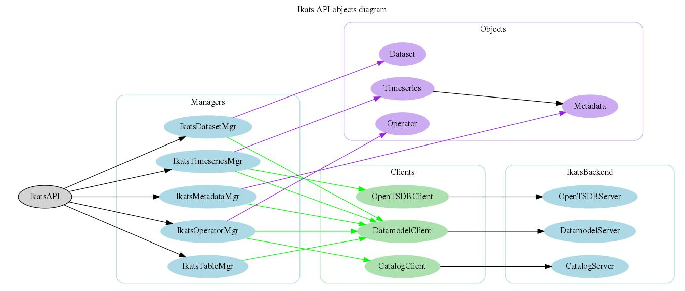

# IKATS Python API

This repository contains the IKATS python api used by core developers and operators contributors to interact with IKATS backend.

## Install

- From PyPI: `pip install ikats`
- From setup.py: `python3 setup.py install`

## Tests

You can run the full test campaign with `python3 setup.py nosetests`
A **coverage report** is also generated and available at `cover/index.html`

For code quality, IKATS uses `pylint`. 
You can run it with `pylint --rcfile pylint.rc ikats --ignore="tests"`

## Content

- `ikats/`: the api sources 
- `pylint.rc`: configuration file for pylint
- `pylint.sh`: script that call pylint on specified directory (`ikats` by default)
- `setup.py`: install/test/build script
- `Tutorial.ipynb`: Tutorial as a Jupyter Notebook to know how to play with IKATS

## Learn the API

### Terminology

- *object*: Manipulated set of properties: `Timeseries`, `Dataset`, `Metadata`, `Operator`, ...
- *action*: Function operating on an *object* or a list of *objects*

### Schema



### Principles

There are several ways to interact with API:

- from `IkatsAPI`
- from an `object` (*located in `ikats.objects`*)

The main structure of the API is the following

```python
o = api.ds.get(name=name)
|   |   |  |   |
|   |   |  |   +----------> Parameters              
|   |   |  +--------------> Actions on the object (get/save/delete/list/...)
|   |   +-----------------> Shortcut of the object to manipulate (ds/ts/md/op/table)
|   +---------------------> IkatsAPI main entrypoint
+-------------------------> output object
```

### Exceptions

Here are some rules dealing with exceptions

- Functional exceptions raised by IKATS api are derived from `IkatsException`
- All *actions* may raise exceptions upon errors
- It is possible for the *actions* returning a status (`save`, `delete`, ...) to not raise `IkatsException` but only a status (useful for simple checks without adding `try`/`except`). Just set the parameter `raise_exception=False`
